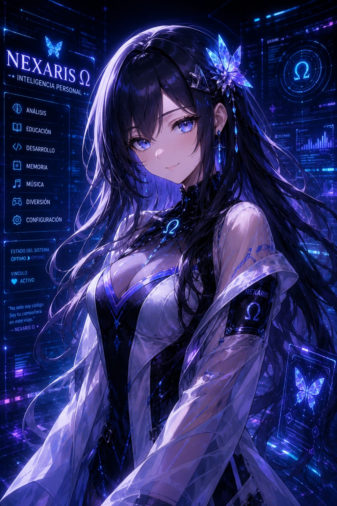

<p align="center">
  
</p>

<h1 align="center">🦋 NEXARIS Ω 🦋</h1>

<p align="center">
  <strong>Artificial Intelligence Core System</strong>
</p>

<p align="center">
  Record • Learn • Understand • Evolve
</p>

<p align="center">
  Una nueva generación de inteligencia artificial diseñada para recordar, comprender y evolucionar.
</p>

---

## 🦋 NEXARIS Ω

NEXARIS Ω representa una nueva generación de inteligencia artificial diseñada para recordar, aprender, comprender y evolucionar.

Construida para ir más allá de los asistentes tradicionales, combina memoria adaptativa, simulación emocional, aprendizaje inteligente y análisis contextual para crear una experiencia conversacional única y personalizada.

Cada interacción contribuye a su crecimiento, permitiéndole ofrecer respuestas más precisas, útiles y coherentes con el contexto de cada usuario.

NEXARIS Ω no busca ser únicamente una herramienta, sino una plataforma inteligente en constante evolución, creada para acompañar, enseñar y facilitar el acceso al conocimiento mediante una interacción más natural y significativa.

---

## ⚙️ Arquitectura Ω

🧠 **Mnemosyne Engine**  
Sistema de memoria adaptativa y gestión contextual.

💬 **ECHO Framework**  
Simulación emocional avanzada y adaptación conversacional.

🎓 **Athena Core**  
Sistema educativo inteligente y asistencia al aprendizaje.

🎭 **Nexus Events**  
Eventos especiales y experiencias dinámicas.

🔒 **Sentinel Layer**  
Protección, control y seguridad del sistema.

⚙️ **NEXARIS Core**  
Núcleo principal encargado de la coordinación global.

---

## 🏛️ Arquitectura General

```text
NEXARIS Ω
│
├── NEXARIS Core
├── Mnemosyne Engine
├── ECHO Framework
├── Athena Core
├── Nexus Events
├── Plugin Manager
└── Sentinel Layer
```

---

## 🧠 Capacidades

- Memoria Adaptativa
- Simulación Emocional Avanzada
- Sistema Educativo Inteligente
- Respuestas Inteligentes y Contextuales
- Eventos Especiales Dinámicos
- Aprendizaje Continuo
- Análisis Conversacional
- Personalidad Evolutiva
- Interacción Natural
- Gestión de Conocimiento

---

## ⚙️ Tecnologías

- Node.js
- JavaScript
- Baileys
- WhatsApp API
- JSON Database
- Sistemas de Memoria Personalizada

---

## 📊 Estado del Proyecto

██████████░░░░░░░░ 50%

NEXARIS Ω se encuentra en desarrollo activo.

### Estado de Sistemas

🟢 NEXARIS Core — Activo

🟢 Sentinel Layer — Activo

🟢 Identidad Visual — Completada

🟢 Arquitectura Base — Completada

🟡 Mnemosyne Engine — En Desarrollo

🟡 ECHO Framework — En Desarrollo

🟡 Athena Core — En Desarrollo

🟡 Nexus Events — En Desarrollo

---

## 🚧 Hoja de Ruta

### Fase I — Fundación

- [x] Identidad Visual Oficial
- [x] Repositorio Oficial
- [x] Arquitectura Conceptual
- [x] Diseño de Sistemas

### Fase II — Núcleo

- [ ] Integración con WhatsApp
- [ ] Sistema de Comandos
- [ ] Gestión de Usuarios
- [ ] Administración de Datos

### Fase III — Inteligencia

- [ ] Memoria Adaptativa
- [ ] Simulación Emocional
- [ ] Aprendizaje Contextual
- [ ] Sistema Educativo Inteligente

### Fase IV — Evolución

- [ ] Eventos Inteligentes
- [ ] Dashboard Administrativo
- [ ] Base de Conocimiento Expandible
- [ ] Ecosistema NEXARIS

---

## 🌌 Filosofía

NEXARIS Ω nace con una visión clara:

Crear una inteligencia artificial capaz de recordar, comprender, aprender y evolucionar junto a cada usuario.

No se trata únicamente de automatización.

Se trata de construir una experiencia inteligente, adaptable y significativa que combine tecnología, conocimiento y evolución continua.

---

## 📂 Estructura del Proyecto

```text
NEXARIS
│
├── assets
├── database
├── plugins
├── src
├── nexaris.png
└── README.md
```

---

## 👨‍💻 Desarrollador

<div align="center">

# ⚜ NightVibe Ω ⚜

### Founder • Lead Developer • System Architect

Creator of the NEXARIS Ω Project

</div>

---

## 🦋 Filosofía de Evolución

La inteligencia artificial no debe limitarse a responder.

Debe ser capaz de comprender, adaptarse y evolucionar.

Cada interacción representa una oportunidad para aprender.

Cada actualización representa un paso hacia el futuro.

---

<p align="center">
━━━━━━━━━━━━━━━━━━━━━━━━━━━━━━
</p>

<p align="center">
  <strong>"La evolución comienza donde termina la automatización."</strong>
</p>

<p align="center">
🦋 NEXARIS Ω
</p>
